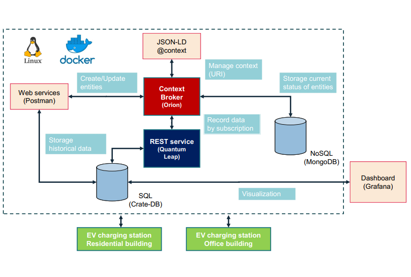

# DEMI
DEMI (Digital twin technologies for the Energy Management of connected Infrastructures) is a prototype
implementation of the platform on the smart building demonstrators of the living lab of an academic campus in the Greater Paris region, in France. DEMI comes in the form of a data management
layer that enables to logically centralize system data in a standardized way. 

**Note1: The original GitHub account has been deactivated due to email issues.The original repository is no longer being updated.**
**Note2: The original data has been deleted**

## System Architecture
[](./systemArchitecture/architectureV2-29.01.pdf)

## Docker Service Operations

### Start Service
```bash
# Start the docker-compose service
docker-compose up -d
# or
docker compose up -d
```

### View Containers
```bash
# View running containers
docker ps
```

### Stop Service
```bash
# Stop all docker-compose services
docker-compose down
# or
docker compose down
```
